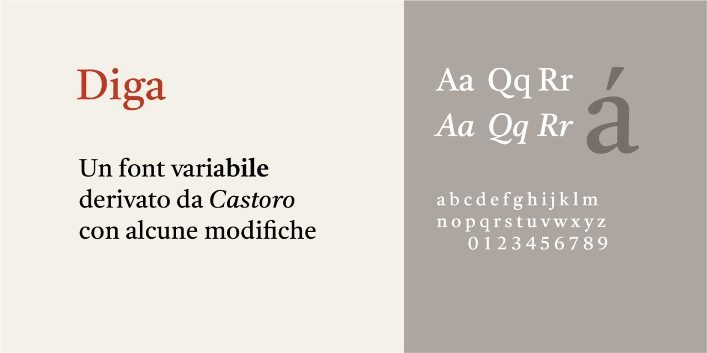
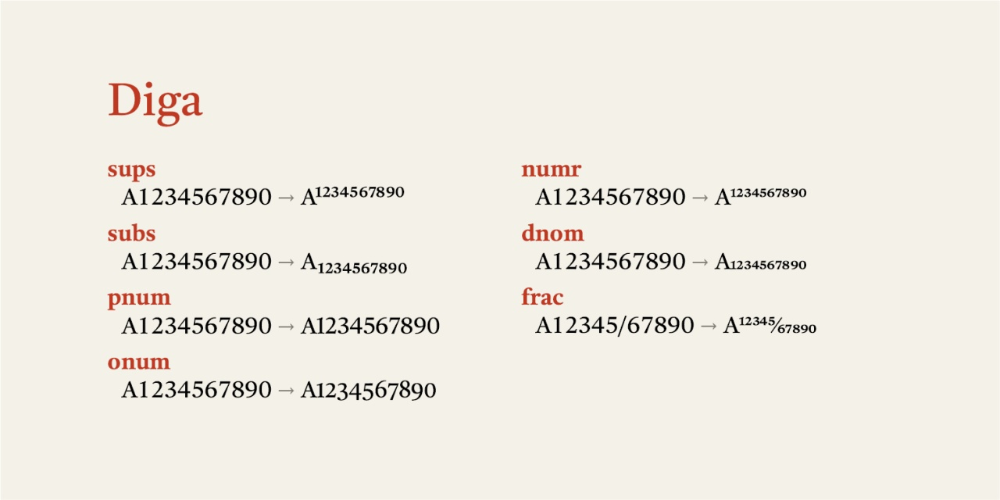

# Diga
- Versione 1.101: sistemazione dei numeri e aggiunta di alcuni caratteri

Per testare il font, vedere la [pagina interattiva](https://m-casanova.github.io/Diga/).

## Descrizione

Il font **Diga** è derivato da _[Castoro](https://github.com/TiroTypeworks/Castoro)_ realizzato da Tiro Typeworks e distribuito con licenza OFL 1.1.

**Diga** è una versione con alcune modifiche.

